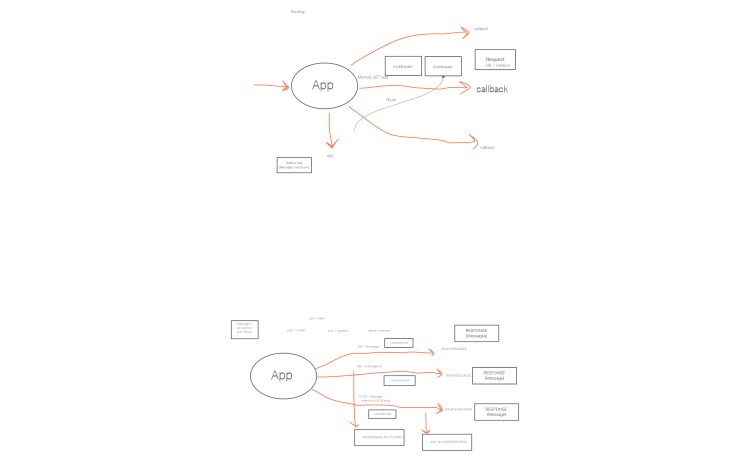

# basic-express-server

## Live Deploy
[Heroku](https://alfredo-basic-express-server.herokuapp.com/)

## Deployment

How do I install the app or library?
Clone this app and install all dependencies.

How do I test the app or library?
Run "NPM test" in the terminal once all dependencies are installed.

For Applications:
How do I run the app?
Run nodemon or node (whatever file you have the start in. In my case it is index.js)
How do I set up the app?
I set up the app with Heroku

## Testing

Write a complete set of tests for all functional units and modules
Your tests must be running green on Github Actions
[TESTS](./__tests__)

## Documentation
